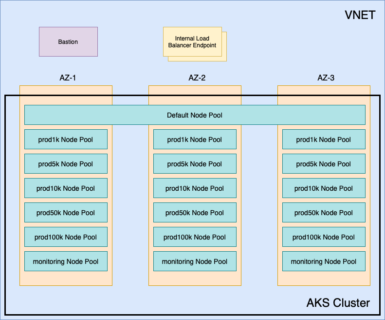

# Reference Terraform for Azure Kubernetes Service

We provide a sample Terraform that you can use as a reference to set up your Kubernetes cluster using Azure Kubernetes Service (AKS). This Terraform gives you recommended practices for the cluster to help ensure your deployment of PubSub+ Cloud is successful.

You can review the architecture and understand how to deploy using the Terraform. For information about the architecture, see:
* [Architecture of AKS Reference Terraform](#aks-architecture)
* [Usage of Terraform for AKS](#aks-usage)

The information on this page pertains to the Terraform. For information about the requirements for the AKS cluster, see the [documentation website](https://docs.solace.com/Cloud/Deployment-Considerations/installing-ps-cloud-k8s-aks-specific-req.htm).

## Architecture of the Reference Terraform for Azure Kubernetes Service <a name="aks-architecture"></a>

The sections describes the architecture reference Terraform project for deploying and Azure Kubernetes Service (AKS) cluster. It includes Kubernetes components and configuration that: 
* are required (or highly recommended) to operate successfully with Solace Cloud
* are recommended but not required to successfully deploy PubSub+ Cloud
* are available to produce a working cluster but we are not opinionated on what to use (an option or configuraton had to be selected as part of the Terraform, but does not impact the installation of PubSub+ Cloud)

The areas to review are the [networking](#aks-network), [cluster configuration](#aks-cluster-config), and [access to and from the cluster](#aks-access). Below is an architectural diagram of the components of the AKS cluster that are created with this Terraform project:



### Network <a name="aks-network"></a>

By default, a VNET with a single subnet is created to host the Azure Kubernetes Service (AKS) cluster.

The Load Balancer that is created as part of the AKS cluster provides Source Network Address Translation (SNAT). This is cheaper and simpler than using NAT Gateways, although you can choose NAT Gateways if required. Using NAT Gateways requires modification of the Terraform project. 

The VNET is an optional component. If the VNET that will host the cluster already exists, or will be created with other automation, you can provide its details in variables.

### Cluster Configuration <a name="aks-cluster-config"></a>

#### Networking

There are currently two options for networking in AKS: Azure CNI and Kubenet. This Terraform project uses Kubenet, which is our recommended option as it provides the most efficient use of IP addresses within the VNET's CIDR. PubSub+ Cloud also supports Azure CNI and you can modify this Terraform project to use it. The result of doing so is a larger CIDR for the VNET, as we recommend a 1:1 event broker service pod to worker node ratio.

The [CIDR Calculator for PubSub+ Cloud](https://docs.solace.com/Cloud/Deployment-Considerations/CIDR_calculator/Solace-cloud-CIDR-calculator.xlsx) can be used to properly size the VNET to support the number of event broker services you require. A correctly sized VNET CIDR is critical as this cannot be changed once the cluster is created.

#### Node Pools

The cluster has the following node pools:

##### Default (System)

The default (system) node pool spans all three availability zones. By default there are two worker nodes in this pool. It uses the `Standard_D2s_v3` VM size. All the standard Kubernetes services as well as PubSub+ Mission Control Agent run on these worker nodes.

##### Event Broker Services

The cluster has a total of 12 node pools for event broker services. Instead of spanning multiple availability zones, there are 4 sets of 3 node pools each locked to a single availability zone. These node pools are locked to a single availability zone to allow the cluster autoscaler to worker properly. We use pod anti-affinity against the node's zone label to ensure that each pod in a high-availability event broker service is in a separate availability zone.

These node pools are engineered to support a 1:1 ratio of event broker service pod to worker node. We use labels and taints on each of these node pools to ensure that only event broker service pods are scheduled on the worker nodes for each scaling tier.

The VM sizes, labels, and taints for each event broker service node pool are as follows:

| Name       | VM size         | Labels                                      | Taints                                                          |
|------------|-----------------|---------------------------------------------|-----------------------------------------------------------------|
| prod1k     | Standard_E2s_v3 | nodeType:messaging<br>serviceClass:prod1k   | nodeType:messaging:NoExecute<br>serviceClass:prod1k:NoExecute   |
| prod10k    | Standard_E4s_v3 | nodeType:messaging<br>serviceClass:prod10k  | nodeType:messaging:NoExecute<br>serviceClass:prod10k:NoExecute  |
| prod100k   | Standard_E8s_v3 | nodeType:messaging<br>serviceClass:prod100k | nodeType:messaging:NoExecute<br>serviceClass:prod100k:NoExecute |
| monitoring | Standard_D2s_v3 | nodeType:monitoring                         | nodeType:monitoring:NoExecute                                   |

### Access<a name="aks-access"></a>

There are two options for cluster access:

 * A bastion host (enabled by default, but you can choose excluded it) which has a public IP and is accessible via SSH from provided CIDRs
 * Optionally, the cluster's API can be made public and restricted to provided CIDRs (by default the API is private)

## Usage of Terraform for Azure Kubernetes Service<a name="aks-usage"></a>

The following section is an overview of the steps to use this Terraform. Before you you begin, review the necessary [prerequistites](aks-prerequisites). Here's an overview of the steps:

1. [Create the Kubernetes cluster](#aks-create-cluster).
1. [Deploy the required storage class](#aks-deploy-storage).


### Prerequisites <a name="aks-prerequisites"></a>

To use this Terraform module, the following is required:

* Terraform 1.3 or above (we recommend [tfenv](https://github.com/tfutils/tfenv) for Terraform version management)
* [Azure Command Line Interface](https://learn.microsoft.com/en-us/cli/azure/install-azure-cli)
* [yq](https://github.com/mikefarah/yq#install)
* [kubectl](https://kubernetes.io/docs/tasks/tools/install-kubectl-linux/)
* [helm](https://helm.sh/docs/intro/install/)

### Creating the Kubernetes Cluster <a name="aks-create-cluster"></a>

1. Navigate to the `terraform/` directory and create a `terraform.tfvars` file with the required variables.

* The VNET's CIDR must be sized appropriately for the number of event broker services that will be created, this can be done using the [CIDR Calculator for PubSub+ Cloud](https://docs.solace.com/Cloud/Deployment-Considerations/CIDR_calculator/Solace-cloud-CIDR-calculator.xlsx) using the 'AKS Kubenet' sheet.
* The `kubernetes_version` variable should be set to the latest Kubernetes version that is [supported by PubSub+ Cloud](https://docs.solace.com/Cloud/Deployment-Considerations/cloud-broker-k8s-versions-support.htm).
* The `bastion_ssh_authorized_networks` variable must be set with the CIDR(s) of the networks where the bastion host will be accessed from.
* The `bastion_ssh_public_key` variable must be set with the public key of the key pair that will be used to access the bastion host.
* The `worker_node_ssh_public_key` variable must be set with the public key of the key pair that will be used to access the worker node hosts.

See the Terraform [README.md](terraform/README.md) for a full list of the required and optional variables available.

For example:

```
region = "eastus2"

cluster_name       = "solace-eastus2"
kubernetes_version = "1.25"

vnet_cidr = "10.1.1.0/24"

bastion_ssh_authorized_networks = ["192.168.1.1/32"]
bastion_ssh_public_key          = "ssh-rsa abc123..."

worker_node_ssh_public_key = "ssh-rsa abc234..."
```

2. Apply the Terraform using the following commands:

```bash
terraform init
terraform apply
```

3. After you create the cluster, set up access to the cluster:

  * If the bastion host was created, use the `connect.sh` script to open a tunnel and set up your environment to access the cluster:

    ```bash
    source ./connect.sh --private-key <ssh private key path> # this creates a proxy via the bastion and sets up a KUBECONFIG file with the appropriate proxy configuration
    ```

  * If the kubernetes API was configured to be publicly accessible, all that is required is a `kubeconfig` file:

    ```bash
    export KUBECONFIG=`mktemp` # this can be excluded if you want your standard ~/.kube/config.yaml file updated
    az aks get-credentials --resource-group <resource-group-name> --name <cluster-name> -f ${KUBECONFIG}
    ```

### Deploying Storage Class <a name="aks-deploy-storage"></a>

Create a Storage Class with these recommended settings:

```bash
kubectl apply -f kubernetes/storage-class.yaml
```
