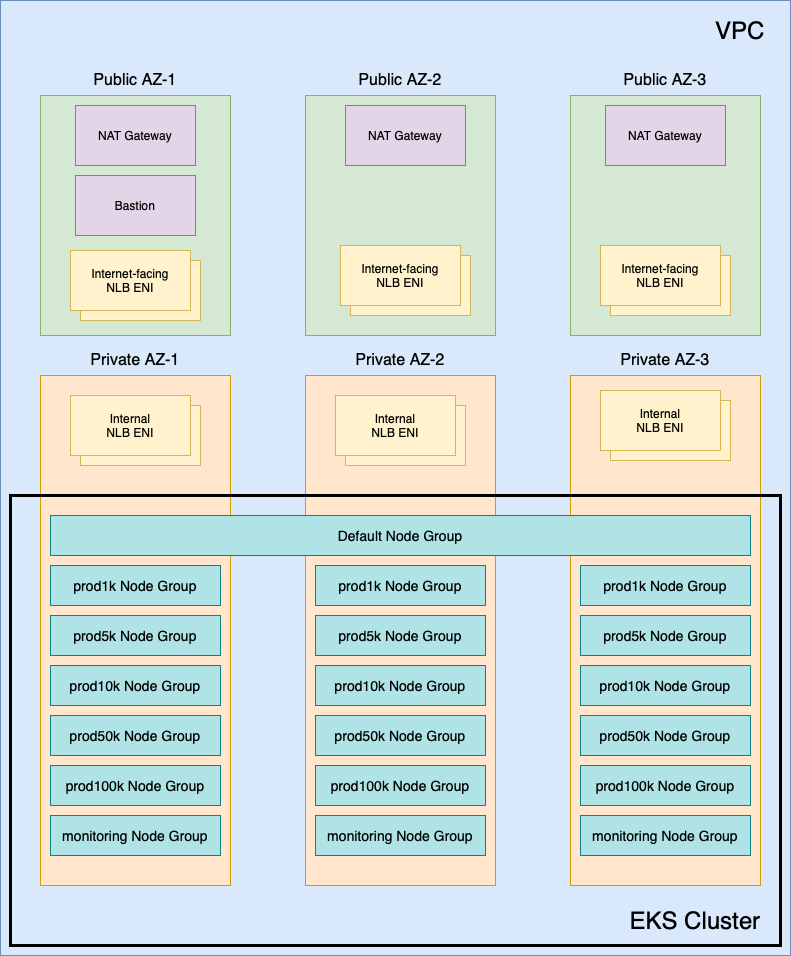

# Reference Terraform for AWS Elastic Kubernetes Service  Deployments

We provide a sample Terraform that you can use as a reference to set up your Kubernetes cluster using Amazon Elastic Kubernetes Service (EKS) cluster.
This Terraform gives you a recommended practices for the cluster to help ensure
your deployment of PubSub+ Cloud is successful.

You can review the architecture and understand how to deploy using the Terraform.
For information about the architecture, see:
* [Architecture of Amazon EKS Terraform](#eks-architecture)
* [Usage of Terraform for Amazon EKS](#eks-usage)

This information on this page pertains to the Terraform. For information about the requirements
for the Amazon EKS cluster, see the [documentation website](https://docs.solace.com/Cloud/Deployment-Considerations/installing-ps-cloud-k8s-eks-specific-req.htm).

## Architecture of Reference Terraform for Amazon EKS<a name="eks-architecture"></a>

The section describes the architecture reference Terraform project for deploying an
Amazon EKS cluster. This information includes Kubernetes components and configuration that:

 * are required (or highly recommended) to operate successfully with Solace PubSub+ Cloud
 * are recommended but not required to successfully deploy PubSub+ Cloud
 * are available to produce a working cluster but where Solace is not opinionated on what to use (an option or the configuration had to be selected as part of the Terraform and doesn't impact the installation of PubSub+ Cloud)

Review these sections below: [networking](#eks-network), [cluster configuration](#eks-cluster-configure), and [access to and from the cluster](#eks-access).

The following architecture diagram shows the components of the EKS cluster that are created with this Terraform project:



### Network <a name="eks-network"></a>

By default, this Terraform creates a Virtual Private Cloud (VPC) that is split into six subnets - three public and three private. 

The public subnets contain:

* NAT gateways (one per subnet)
* Bastion host
* Network Load balancers (NLBs) Elastic Network Interfaces (ENIs) for any internet-facing event broker service endpoints

The private subnets contain:

* Worker nodes
* NLB ENIs for any internal Event Broker Service endpoints

The public internet is accessed in the private subnets via the NAT Gateways. There are no restrictions on egress traffic to the public internet.

The [CIDR Calculator for PubSub+ Cloud](https://docs.solace.com/Cloud/Deployment-Considerations/CIDR_calculator/cloud-CIDR-calculator.xlsx) can be used to properly size the VPC to support the number of event broker services that you require. A correctly sized VPC CIDR is important as this cannot be changed after the cluster has been created.

The VPC is an optional component. If the VPC that hosts the cluster exists or is created created with other automation, its details can be provided in variables.

### Cluster Configuration <a name="eks-cluster-configure"></a>
The following are Kubernetes cluster settings for:
Node Groups
Add-ons and Supporting Services

#### Node Groups <a name="eks-node-groups"></a>

The cluster has the following node groups:

##### Default (System)

The default (system) node group spans all three availability zones. By default there are two worker nodes in this pool, and it uses the `m5.large` instance type. All the standard Kubernetes services, as well as the PubSub+ Mission Control Agent run on these worker nodes.

##### Event Broker Services <a name="eks-broker-services"></a>

The cluster has a total of 12 node groups for event broker services. Each event broker service runs in pod (referred to as a *broker pod*).  Instead of spanning multiple availability zones, there are four sets of three node groups with each locked to a single availability zone. These node groups are locked to one availability zone to allow the cluster autoscaler to work properly. In the Terraform,  we use pod anti-affinity against the node's zone label to ensure that each pod in a high-availability event broker service is in a separate availability zone.

These node groups are engineered to support a 1:1 ratio of the broker pod to worker node. We use labels and taints on each of these node groups to ensure that only Event Broker Service pods are scheduled on the worker nodes for each scaling tier.

The instance types, labels, and taints for each node group for event broker services are shown in the following table:

| Name       | Instance type | Labels                                      | Taints                                                          |
|------------|---------------|---------------------------------------------|-----------------------------------------------------------------|
| prod1k     | r5.large      | `nodeType:messaging`<br/>`serviceClass:prod1k`   | `nodeType:messaging:NoExecute`<br/>`serviceClass:prod1k:NoExecute`   |
| prod10k    | r5.xlarge     | `nodeType:messaging`<br/>`serviceClass:prod10k`  | `nodeType:messaging:NoExecute`<br/>`serviceClass:prod10k:NoExecute`  |
| prod100k   | r5.2xlarge    | `nodeType:messaging`<br/>`serviceClass:prod100k` | `nodeType:messaging:NoExecute`<br/>`serviceClass:prod100k:NoExecute` |
| monitoring | t3.medium     | `nodeType:monitoring`                         | nodeType:monitoring:NoExecute                                   |

#### Add-ons + Supporting Services <a name="eks-addon"></a>

Amazon EKS uses an add-on model for built-in supporting services: https://docs.aws.amazon.com/eks/latest/userguide/eks-add-ons.html

The Terrafrom project deploys the following add-ons:

 * aws-ebs-csi-driver
 * vpc-cni
 * coredns
 * kube-proxy

IAM Roles for Service Accounts (IRSA) is used to provide add-ons with the appropriate AWS IAM permissions to operate: https://docs.aws.amazon.com/eks/latest/userguide/iam-roles-for-service-accounts.html

PubSub+ Cloud  requires the use of `cluster-autoscaler` and `aws-load-balancer-controller` to operate. Instructions can be found below on how to deploy them into the cluster using the Helm values provided by the Terrafrom project. 

IRSA is used to provide permissions to both the `cluster-autoscaler` and `aws-load-balancer-controller`.

By default, Amazon EKS is configured to efficiently scale up the number of pods on a worker node by having a large warm pool of IP addresses and Elastic Network Interfaces (ENIs). We recommend a 1:1 broker pod to worker node architecture to reduce the number of wasted IP addresses. To accomplish this, the `vpc-cni` add-on is configured with `WARM_IP_TARGET=1` and `WARM_ENI_TARGET=0`. For more details, see https://github.com/aws/amazon-vpc-cni-k8s/blob/master/docs/eni-and-ip-target.md.

### Access <a name="eks-access"></a>

You have two options for cluster access:

 * A bastion host (Enabled by default - but you can choose to exclude it)
   * By default, the bastion has a public IP address and is accessible via SSH from the provided CIDRs
   * Optionally, can be created without public IP and (in either case) is accessible via the [AWS Systems Manager](https://www.amazonaws.cn/en/systems-manager/).
 * Optionally, the cluster's API can be made public and restricted to provided CIDRs (by default the API is private)

The worker node hosts are accessible via the AWS Systems Manager.

### Authentication <a name="eks-authentication"></a>

By default, the EKS cluster created by this terraform project is configured to use `ConfigMap` authentication mode as described [here](https://docs.aws.amazon.com/eks/latest/userguide/access-entries.html). With this method, access to the cluster is configured by adding user or role ARNs to the `aws-auth` ConfigMap in the cluster. This option has been kept as the default in this terraform project for backwards compatibility.

We recommend, though, that you use the `access entries` mode instead, which allows for management of the users and roles that can access the cluster API, as well as their access levels, from outside the cluster. Further details of this option can be found in the link above. 

To use the `access entries` mode with this terraform project, set the `kubernetes_cluster_auth_mode` to `API` and include at least one user or role ARN in the `kubernetes_cluster_admin_arns` variable. This mode may be made the default in a future major version of this project.

## Usage of Terraform for Amazon EKS <a name="eks-usage"></a>
The following section is an overview of the steps to use this Terraform. Before you
you begin, review the necessary [prerequistites](#eks-prerequisites).
Here's an overview of the steps:
1. [Create the Kubernetes cluster](#eks-create-cluster).
1. [Deploy the required storage class](#eks-deploy-storage).
1. [Deploy the autoscaler](#eks-deploy-autoscaler).
1. [Deploy the the AWS load balancer](#eks-deploy-lb).
1. [Configure the IP address uage for the cluster](#"eks-ip-addresses).


### Prerequisites <a name="eks-prerequisites"></a>

To use this Terraform module, you require:

* Terraform 1.3 or above (we recommend using [tfenv](https://github.com/tfutils/tfenv) for Terraform version management)
* [AWS Command Line Interface](https://aws.amazon.com/cli/)
* [yq](https://github.com/mikefarah/yq#install)
* [kubectl](https://kubernetes.io/docs/tasks/tools/install-kubectl-linux/)
* [helm](https://helm.sh/docs/intro/install/)

### Creating the Kubernetes Cluster <a name="eks-create-cluster"></a>

1. Navigate to the `terraform/` directory and create a `terraform.tfvars` file with the required variables. The VPC and subnet CIDRs must be sized appropriately for the number of event broker services that you require to be created, this can be done using the (PubSub+ Cloud CIDR Calculator)[https://docs.solace.com/Cloud/Deployment-Considerations/CIDR_calculator/Solace-cloud-CIDR-calculator.xlsx].
In the file, make the following changes:
* The `kubernetes_version` variable should be set to the latest Kubernetes version that is [supported by PubSub+ Cloud](https://docs.solace.com/Cloud/Deployment-Considerations/cloud-broker-k8s-versions-support.htm).
* The `bastion_ssh_authorized_networks` variable must be set with the CIDRs of the networks where the bastion host will be accessed from.
* The `bastion_ssh_public_key` variable must be set with the public key of the key pair that will be used to access the bastion host.

See the Terraform [README.md](terraform/README.md) for a full list of the required and optional variables that are available.

For example:

```
region             = "eu-west-3"
cluster_name       = "solace-eu-west-3"
kubernetes_version = "1.27"

vpc_cidr = "10.10.0.0/24"

public_subnet_cidrs = [
  "10.10.0.0/28",
  "10.10.0.16/28",
  "10.10.0.32/28"
]

private_subnet_cidrs = [
  "10.10.0.64/26",
  "10.10.0.128/26",
  "10.10.0.192/26"
]

bastion_ssh_authorized_networks = ["192.168.1.1/32"]
bastion_ssh_public_key          = "ssh-rsa abc123..."
```

2. Apply the Terraform using the following command:

```bash
terraform init
terraform apply
```

3. After you create the cluster, set up access to the cluster:

  * If the bastion host was created with a public IP address, use the `connect.sh` script to open a tunnel and set up your environment to access the cluster:

    ```bash
    source ./connect.sh --private-key <ssh private key path> # this creates a proxy via the bastion and sets up a KUBECONFIG file with the appropriate proxy configuration
    ```

  * If the Kubernetes API was configured to be fpr public access,  all that is required is a `kubeconfig` file:

    ```bash
    export KUBECONFIG=`mktemp` # this can be excluded if you want your standard ~/.kube/config.yaml file updated
    aws eks update-kubeconfig --region <aws-region> --name <cluster-name>
    ```

### Deploying Storage Class <a name="eks-deploy-storage"></a>

We recommend you use a GP3-based Storage Class. For disks less than 1 TB, GP3 is cheaper and more performant.

Create a GP3 storage class with these recommended settings:

```bash
kubectl apply -f kubernetes/storage-class-gp3.yaml
```

For large (greater than 1TB) disks, we recommend using GP2 which has more performance for the price than GP3.

Create a GP2 storage class with these recommended settings:

```bash
kubectl apply -f kubernetes/storage-class-gp2.yaml
```

This steps require that you delete any existing GP2 storage class first if it isn't used, or renaming ours so it does not conflict.

### Deploying Cluster Autoscaler <a name="eks-deploy-autoscaler"></a>
For more infomration about deploying the cluster autoscaler, see https://github.com/kubernetes/autoscaler/blob/master/cluster-autoscaler/cloudprovider/aws/README.md

You're supposed to run a cluster-autoscaler version that matches your kubernetes version, so for example use the latest v1.23 cluster autoscaler with kubernetes v1.23.

You can search for the latest correct version here: https://github.com/kubernetes/autoscaler/releases

```bash
helm repo add autoscaler https://kubernetes.github.io/autoscaler
helm repo update autoscaler

terraform output -raw -state=terraform/terraform.tfstate cluster_autoscaler_helm_values | \
    helm upgrade --install cluster-autoscaler autoscaler/cluster-autoscaler --version 9.35.0 -n kube-system --values - --set image.tag=<version>
```

###  Deploying AWS Load Balancer Controller <a name="eks-deploy-lb"></a>
We recommend that you deploy the AWS Load Balancer.

```bash
helm repo add eks https://aws.github.io/eks-charts
helm repo update eks

terraform output -raw -state=terraform/terraform.tfstate load_balancer_controller_helm_values | \
    helm install aws-load-balancer-controller eks/aws-load-balancer-controller --version 1.7.1 -n kube-system --values -
```
