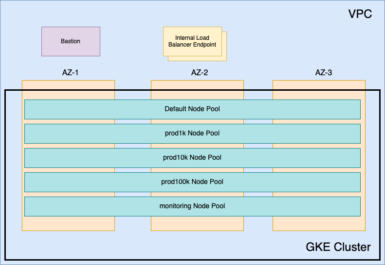

# Reference Terraform for Google Kubernetes Engine

We provide a sample Terraform that you can use as a reference to set up your Kubernetes cluster using Google Kubernetes Engine (GKE). This Terraform gives you a recommended practices for the cluster to help ensure your deployment of Solace Cloud is successful.

You can review the architecture and understand how to deploy using the Terraform.
For information about the architecture, see:
* [Architecture of GKE Terraform](#gke-architecture)
* [Usage of Terraform for GKE](#gke-usage)

The information on this page pertains to the Terraform. For information about requirements
for the GKE cluster, see the [documentation website](https://docs.solace.com/Cloud/Deployment-Considerations/installing-ps-cloud-k8s-gke-specific-req.htm).

## Architecture of Reference Terraform for GKE<a name="gke-architecture"></a>

This section describes the architecture reference Terraform project for deploying a GKE cluster. This information includes Kubernetes components and configuration that:

 * are required (or highly recommended) to operate successfully with Solace Solace Cloud
 * are recommended but not required to successfully deploy Solace Cloud
 * are available to produce a working cluster but where Solace is not opinionated on what to use (an option or the configuration had to be selected as part of the Terraform and doesn't impact the installation of Solace Cloud)

Review these sections below: [networking](#gke-network), [cluster configuration](#gke-cluster-configure), and [access to and from the cluster](#gke-access).

The following architecture diagram shows the components of the GKE cluster that are created with this Terraform project:




### Network <a name="gke-network"></a>

By default, this Terraform creates a Virtual Private Cloud (VPC) with a single subnet to host the GKE cluster.

The GKE cluster is configured to use private nodes, so a Cloud NAT is included in VPC to provide SNAT.

The VPC is an optional component. If the VPC that will host the cluster already exists or will be created with other automation, its details can be provided in variables.

### Cluster Configuration <a name="gke-cluster-configure"></a>

#### Networking

Currently, there are two options for networking in GKE - VPC-native or route-based. This Terraform project uses VPC-native, which is Google Cloud's recommended option and the only option available when the cluster is configured to have private nodes.

Three CIDR ranges are required, with an optional fourth CIDR range, as described below:

| Name           | Required? | Routable?                                        | Use                                                                                                                                                     |
|----------------|-----------|--------------------------------------------------|---------------------------------------------------------------------------------------------------------------------------------------------------------|
| network        | Yes       | Yes, it needs to be routable                     | Used by all VMs in the VPC including worker nodes, as well as internal load balancers                                                                   |
| services       | Yes       | No                                               | Used by kubernetes services, not exposed outside the cluster                                                                                            |
| pods           | Yes       | Yes, if the 'messaging pods' CIDR is not defined | Used to assign CIDR ranges to worker nodes for pod IPs. If the 'messaging pods' range is provided, this is used for just the system (default) node pool |
| messaging pods | No        | Yes, it needs to be routable                     | Used to assign CIDR ranges to worker nodes that host messaging (broker) pods their IPs                                                                  |

The size of the CIDR ranges assigned to worker nodes for pod IPs is dependent on the 'max_pod_per_node' settings, which are configurable in this terraform project. The default of 16 for system nodes and 8 for messaging nodes means that /27 and /28 CIDR ranges (respectively) are assigned to the worker nodes. 

Using a separate messaging pods range is useful when the routable CIDRs available is constrained. For example, with a network CIDR of 10.1.1.0/24 and messaging pods CIDR of 10.1.2.0/24, a total of 16 worker nodes can host messaging pods, which means a total of 5 HA broker services can be created in the cluster. A messaging pods CIDR of 10.1.2.0/25 would allow for just 2 HA broker services.

The requirement that a CIDR be 'routable' is only true when private networking (peering, etc) is the desired mechanism of communication to or from broker services.

#### Node Pools

The cluster has the following node pools:

##### Default (System)

By default the pool has three worker nodes (one in each availability zone), and it uses the `n2-standard-2` machine type. All of the standard Kubernetes services, as well as the Solace Mission Control Agent, run on these worker nodes.

##### Event Broker Services

The cluster has a total of 4 node pools for event broker services. Because GKE node pools are made up of separate managed instance groups that are locked to a single availability zone, the cluster autoscaler can properly handle our use of pod anti-affinity against the node's zone label to ensure that each pod in a high-availability event broker service is in a separate availability zone.

These node pools are engineered to support a 1:1 ratio of event broker service pod to worker node. We use labels and taints on each of these node pools to ensure that only event broker service pods are scheduled on the worker nodes for each scaling tier.

The machine types, labels, and taints for each event broker service node pool are as follows:

| Name       | Machine  type | Labels                                      | Taints                                                          |
|------------|---------------|---------------------------------------------|-----------------------------------------------------------------|
| prod1k     | n2-highmem-2  | nodeType:messaging<br>serviceClass:prod1k   | nodeType:messaging:NoExecute<br>serviceClass:prod1k:NoExecute   |
| prod10k    | n2-highmem-4  | nodeType:messaging<br>serviceClass:prod10k  | nodeType:messaging:NoExecute<br>serviceClass:prod10k:NoExecute  |
| prod100k   | n2-highmem-8  | nodeType:messaging<br>serviceClass:prod100k | nodeType:messaging:NoExecute<br>serviceClass:prod100k:NoExecute |
| monitoring | e2-standard-2 | nodeType:monitoring                         | nodeType:monitoring:NoExecute                                   |

### Access <a name="gke-access"></a>

You have two options for cluster access:

 * A bastion host (enabled by default, but you can choose to exclude it)
   * By default, the bastion has a public IP address and is accessible via SSH from the provided CIDRs
 * Optionally, the cluster's API can be made public and restricted to provided CIDRs (by default the API is private)

## Usage of Terraform for GKE <a name="gke-usage"></a>

This section is an overview of the steps to use this Terraform. Before you you begin, review the necessary [prerequistites](#gke-prerequisites).
Here's an overview of the steps:
1. [Create the Kubernetes cluster](#gke-create-cluster).
1. [Deploy the required storage class](#gke-deploy-storage).

### Prerequisites <a name="gke-prerequisites"></a>

To use this Terraform module, you require:

* Terraform 1.3 or above (we recommend using [tfenv](https://github.com/tfutils/tfenv) for Terraform version management)
* [Google Cloud SDK](https://cloud.google.com/sdk)
* [yq](https://github.com/mikefarah/yq#install)
* [kubectl](https://kubernetes.io/docs/tasks/tools/install-kubectl-linux/)
* [helm](https://helm.sh/docs/intro/install/)

### Creating the Kubernetes Cluster <a name="gke-create-cluster"></a>

1. Navigate to the `terraform/` directory and create a `terraform.tfvars` file with the required variables. The VPC and subnet CIDRs must be sized appropriately for the number of event broker services that you require to be created. Make the following changes in the file:

* The `kubernetes_version` variable should be set to the latest Kubernetes version that is [supported by Solace Cloud](https://docs.solace.com/Cloud/Deployment-Considerations/cloud-broker-k8s-versions-support.htm).
* The `network_cidr_range`, `secondary_cidr_range_pods`, and `secondary_cidr_range_services` variables set the CIDR ranges that will be used for the network, pods, and services. The `secondary_cidr_range_pods` and `secondary_cidr_range_services` variables end up as secondary CIDR ranges in the cluster's subnet and cannot overlap.
* The `bastion_ssh_authorized_networks` variable must be set with the CIDRs of the networks where the bastion host will be accessed from.
* The `bastion_ssh_public_key` variable must be set with the public key of the key pair that will be used to access the bastion host.

See the Terraform [README.md](terraform/README.md) for a full list of the required and optional variables that are available.

For example:

```
project = "project123"
region  = "us-east1"

cluster_name       = "solace-us-east1"
kubernetes_version = "1.29"

network_cidr_range                  = "10.10.1.0/24"
secondary_cidr_range_services       = "172.25.0.0/16"
secondary_cidr_range_pods           = "172.26.0.0/16"
secondary_cidr_range_messaging_pods = "10.10.2.0/24"

bastion_ssh_authorized_networks = ["192.168.1.1/32"]
bastion_ssh_public_key          = "ssh-rsa abc123..."
```

2. Apply the Terraform using the following command:

```bash
terraform init
terraform apply
```

3. After you create the cluster, set up access to the cluster:

* If the bastion host was created with a public IP address, use the `connect.sh` script to open a tunnel and set up your environment to access the cluster:

    ```bash
    source ./connect.sh --private-key <ssh private key path> # this creates a proxy via the bastion and sets up a KUBECONFIG file with the appropriate proxy configuration
    ```

* If the kubernetes API was configured to be publicly accessible, all that is required is a kubeconfig file:

    ```bash
    export KUBECONFIG=`mktemp` # this can be excluded if you want your standard ~/.kube/config.yaml file updated
    gcloud container clusters get-credentials <cluster-name> --region <region>
    ```

### Deploying Storage Class <a name="gke-deploy-storage"></a>

Create a Storage Class with these recommended settings:

```bash
kubectl apply -f kubernetes/storage-class.yaml
```

## Changelog

### v2

#### Breaking Changes

The v2 version of this Terraform project introduces a breaking change in the way that the secondary CIDRs are configured for services and pods in the clusters. In the v1 project, this was done via the cluster itself but there are limitations in the size of the CIDRs that make it impossible to run very small GKE clusters. The v2 project updates this to create secondary ranges directly in the cluster's subnetwork, which provides the flexibility to tailor the ranges to support smaller clusters that are more efficient in their use of IPs.

The impact of this change is that v1-based clusters cannot be migrated easily to v2 clusters.

#### Other Changes

The v2 version of this Terraform project has moved the use of the node pool modules from the cluster module to the main project.
